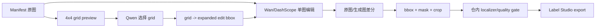
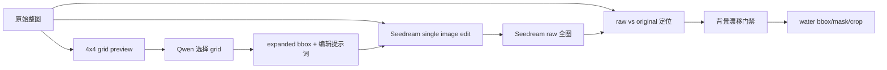
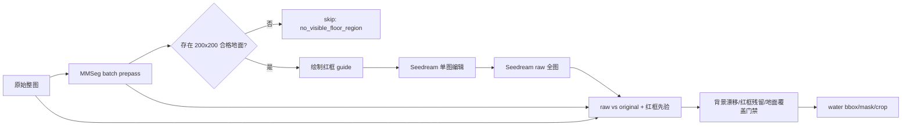
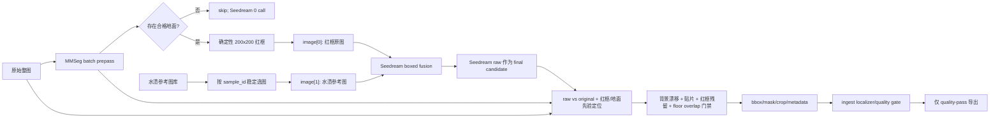
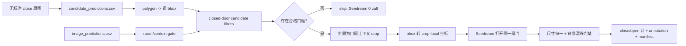

# 图像生成发布前说明

> 快照日期：2026-08-03
>
> 分支：`feature/datagen`
>
> 适用范围：`scripts/run_pipeline.py`、`external/I2I`、`scripts/generate_cabinet_door_open.py`

## 1. 发布口径

当前代码按“图像模型请求的输入和处理方式”划分，共有 **5 种调用 pattern**：

| ID | 场景 | 图像模型输入 | Selector | 图像模型调用 | 发布定位 |
|---|---|---|---|---:|---|
| G0 | 通用工业异常，旧 I2I | 原图或局部 crop，单图 | Qwen 4x4 grid | 1 次 | 兼容保留，不推荐 Seedream 使用 |
| G1 | 漏水单图编辑 | 原始整图，单图 | Qwen 4x4 grid | 1 次 | 实验对照 |
| G2 | 漏水红框单图编辑 | 带 200x200 红框的整图，单图 | MMSeg 地面分割，或旧 Qwen grid | 1 次 | 实验候选 |
| G3 | 漏水红框双图融合 | 红框整图 + 水渍参考图，双图 | MMSeg 地面分割，或旧 Qwen grid | 1 次 | 当前漏水推荐路径 |
| G4 | 柜门打开正例 | 检测框的上下文 crop，单图 | 柜门分割 CSV；VLM 仅兼容 | 1 次 | 当前柜门推荐路径 |

Selector 不是额外的图像生成版本，而是图像生成前的选区实现：

- `qwen_grid_selector`：VLM 在 4x4 grid 中选区。
- `mmseg_floor_selector`：SegFormer 只在 `road=2` 地面类别中选择固定 200x200 区域。
- `segmentation_candidates`：直接读取柜门分割/分类 CSV 中的 polygon/bbox。
- `vlm`：柜门链路的兼容 selector，可走 Ark Responses 或 OpenAI-compatible VLM。

## 2. 统一模型与 API Pattern

### Seedream

当前默认模型：

```text
doubao-seedream-5-0-pro-260628
```

默认服务：

```text
base_url=https://ark.cn-beijing.volces.com/api/v3
transport=OpenAI().images.generate(...)
fallback=POST /api/v3/images/generations
```

公共参数：

```json
{
  "model": "doubao-seedream-5-0-pro-260628",
  "n": 1,
  "size": "2K",
  "response_format": "url",
  "output_format": "png",
  "watermark": false
}
```

输入图通过 `extra_body.image` 传递：单图时为一个 data URL，双图时为 data URL 数组。每个 selected sample 只发起一次逻辑 Seedream 请求。

### Qwen/VLM

漏水旧 selector 默认仍使用 OpenAI-compatible `qwen3.6-27b`。柜门兼容 VLM selector 可配置为 Ark Responses：

```text
POST https://ark.cn-beijing.volces.com/api/v3/responses
model=doubao-seed-2-1-pro-260628
```

当前推荐路径 G3/MMseg 和 G4/segmentation_candidates 均不调用 VLM。

## 3. G0：旧通用 I2I

调用模式：

```text
Qwen grid selector: 1 logical call
Wan/DashScope image edit: 1 logical call
```



Wan payload 使用 `input.messages[].content` 传图和文本，编辑框使用 `parameters.bbox_list`。这条链路保留用于旧 DashScope/Wan backend。

Seedream 不应在未指定实验 mode 时走该路径。隐式 `crop_then_paste` 仅是历史兼容代码，生产 preflight 默认阻止 reference-generation endpoint 被当作局部 inpaint。

## 4. G1：Seedream `single_image_edit`

调用模式：

```text
Qwen grid selector: 1 logical call
Seedream Pro: 1 image in -> 1 image out
payload.image = original full image
```



特点：不画红框、不传水渍参考图。定位完全依赖 prompt bbox 先验和 raw-vs-original 差分。该模式主要用作 Seedream 单图编辑能力的对照实验，不是当前批量漏水首选。

## 5. G2：Seedream `boxed_single_edit`

调用模式：

```text
推荐 selector: MMSeg floor selector
Seedream Pro: 1 image in -> 1 image out
payload.image = full image with a 200x200 red guide box
```



MMSeg 规则：仅 `road=2` 可选；`line=1` 和 `background=0` 不可选；候选框要求 road coverage >= 95%、line coverage <= 5%。无合格地面时不调用 Seedream。

G2 不需要水渍参考图，适合作为 G3 的消融对照。

## 6. G3：Seedream `boxed_fusion`

调用模式：

```text
推荐 selector: MMSeg floor selector
Seedream Pro: 2 images in -> 1 image out
payload.image = [red-box source image, water-stain reference image]
```



当前后处理不再把保守水渍 mask 从 raw 抠出后贴回原图。Seedream raw 全图直接作为最终候选；bbox/crop 单独由 raw-vs-original、红框先验和地面 mask 定位。这样保留模型融合质感，同时把标注框约束在水渍核心区域。

请求前置条件：

- `ARK_API_KEY` 有效。
- `MMSEG_FLOOR_PYTHON`、`MMSEG_FLOOR_CHECKPOINT` 和 device 可用。
- checkpoint 与三分类 SegFormer 配置兼容。
- 水渍参考目录存在且至少包含一张支持格式图片。
- 红框 min/max 均为 200。

## 7. G4：柜门打开 `cabinet_door_open`

调用模式：

```text
默认 selector: segmentation_candidates, 0 VLM call
Seedream Pro: 1 context crop in -> 1 context crop out
```



关键约束：

- Seedream 只接收检测框周边的 context crop，不接收完整机房图。
- 不把生成 crop 贴回原始全图；目标产物是严格对齐的 close/open 分类对。
- 默认直接使用柜门分割和分类结果，不再让大模型自由选择对象。
- `--reviewed-all-close` 是人工真值覆盖，只用于已确认全部为 close 的误报告警集。
- `--selector-backend vlm` 仅作兼容，不是 segmentation backend 的 fallback。

已完成的 14 张分类错误集运行结果：14 accepted、0 failed、0 Qwen call、14 Seedream call，产物位于 `outputs/classification_errors_14_open/pairs`。

## 8. 版本调用矩阵

| Pattern | Selector 调用 | Seedream/Wan 调用 | 输入图数量 | 是否生成全图 | 最终 bbox 来源 |
|---|---:|---:|---:|---|---|
| G0 旧 I2I | Qwen 1 | Wan 1 | 1 | 是 | image diff，后续仓内 localizer |
| G1 single | Qwen 1 | Seedream 1 | 1 | 是 | raw-vs-original + prompt bbox |
| G2 boxed single | MMSeg batch 1 次加载/每图推理 | Seedream 1 | 1 | 是 | raw-vs-original + red box + floor mask |
| G3 boxed fusion | MMSeg batch 1 次加载/每图推理 | Seedream 1 | 2 | 是 | raw-vs-original + red box + floor mask |
| G4 cabinet open | CSV selector 0 | Seedream 1 | 1 | 否，生成 context crop | 原始 door bbox + generated change bbox |

这里的调用次数是“逻辑模型调用”。OpenAI SDK 或网络层可能对超时进行底层重试；账单审计应同时查看 Ark 服务端 request ID 和本地 `logs/*_request.json`、`logs/*_response.json`，不能仅依赖逻辑计数。

## 9. 输出与质量门禁

### 漏水生成

```text
i2i_outputs/
  generated_images/                 最终候选全图
  metadata/                         I2I metadata
  crops/                            水渍 bbox crop
  masks/                            水渍 mask
  debug/seedream_raw_outputs/       Seedream 原始响应图
  debug/seedream_raw_diff_masks/    raw-vs-original 候选变化
  debug/floor_masks/                road mask
  debug/floor_overlays/             地面框可视化
  logs/requests|responses/           请求/响应审计
  logs/run_summary.json             调用与产物统计
```

`run_pipeline.py` 会继续 ingest I2I metadata，执行仓内 localizer/quality gate。Label Studio export 只允许所有对象同时满足：

```text
localizer.postprocess_status == success
quality.passes_quality == true
```

拒绝样本写入 `rejected_generated_quality.json`，不混入交付数据。

### 柜门生成

```text
pairs/
  close/          原始 context crop
  open/           Seedream open crop
  annotations/    source/context/crop-local bbox
  manifest.csv    一一对应关系
```

柜门分类对目前是独立脚本产物，不进入漏水的 Label Studio export DAG。

## 10. 发布建议

### 推荐发布

- 漏水：G3 + `mmseg_floor_selector` + Seedream Pro。
- 无参考图漏水对照：G2 + `mmseg_floor_selector`。
- 柜门正例：G4 + `segmentation_candidates` + context crop。

### 仅保留实验/兼容

- G1 `single_image_edit`：用于能力对照。
- Qwen grid 漏水选区：用于非漏水任务或历史回归，不作为地面选区 fallback。
- 柜门 VLM selector：仅兼容。
- G0 Wan/DashScope：旧 backend 兼容。

### 不发布为生产能力

- Seedream 隐式 `crop_then_paste`。
- 把 `/images/generations` 宣称为 mask/inpaint 接口。
- 将 200x200 引导框直接当作最终水渍标注框。
- 从保守 final composition 反向抠 bbox；当前应从 raw candidate 定位。

## 11. 发布前 Checklist

- [ ] 将当前工作树中的柜门生成实现和测试提交到 Git；发布 tag 不应基于 dirty tree。
- [ ] 清理或忽略 `outputs/`、`.tmp_*`、测试结果、备份图像和 zip，不把生成资产提交进代码版本。
- [ ] 确认仓库中没有 API key；`ARK_API_KEY`、MMSeg checkpoint 均只通过环境变量/外部路径提供。
- [x] 2026-08-03 运行 `python -m pytest -q`：147 passed。
- [ ] 漏水先完成 10 张 smoke test，再完成 50 张人工校准；无地面图片必须 skip。
- [ ] 核对 `run_summary.json` 的 selected、Seedream call、accepted/rejected 数量。
- [ ] 人工检查 floor overlay、Seedream raw、final、mask 和 crop 的坐标一致性。
- [ ] 柜门检查 close/open 尺寸一致、对象身份一致、仅目标门状态变化。
- [ ] 使用新的 `--processed-root`/`--output-root` 发布运行，避免旧 artifacts 被 `--skip-existing` 误复用。
- [ ] 只发布质量门禁通过样本；失败 raw 图保留用于审计，不进入交付集。

## 12. 当前发布风险

1. Seedream 三种漏水模式在 metadata 中仍标记为 `experimental_seedream=true`；G3 是当前推荐实验路径，但尚未完成正式 50 张人工质量验收。
2. MMSeg checkpoint 不随仓库发布，新环境缺少 checkpoint 或独立 Python 运行时会在 preflight 阶段失败。
3. Seedream 是生成/交互编辑接口，不提供本链路可验证的硬 mask inpaint 保证，因此必须保留背景漂移和结构变化门禁。
4. 当前工作树包含尚未提交的柜门改动及本地产物；发布前需要提交代码并清理发布包边界。
5. 模型逻辑调用计数不等价于计费请求数；超时重试必须结合 Ark 服务端日志审计。
